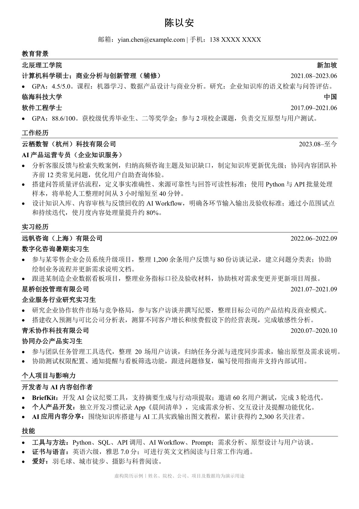
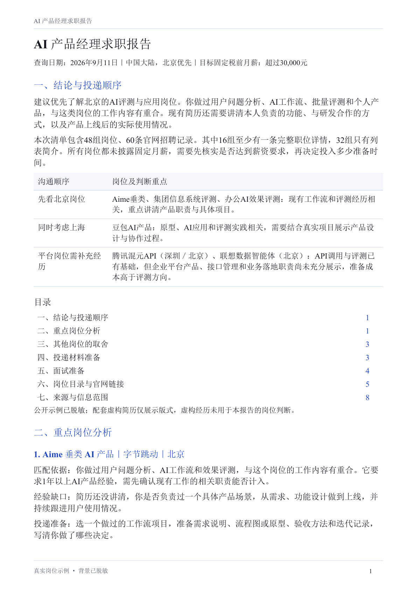
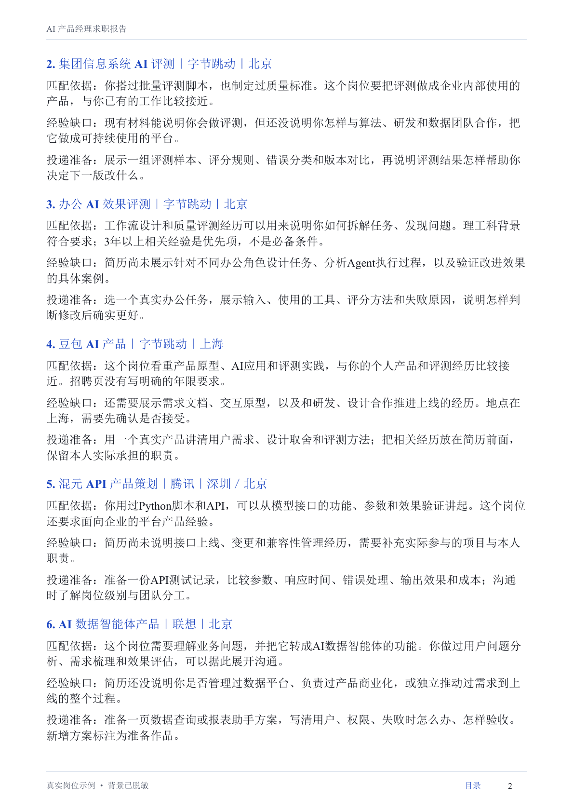

# job-hunt：找岗位、做简历、练面试

<p align="center">
  <a href="README.md"><strong>简体中文</strong></a> ·
  <a href="README_EN.md">English</a> ·
  <a href="README_JA.md">日本語</a> ·
  <a href="README_KO.md">한국어</a> ·
  <a href="README_ES.md">Español</a>
</p>

<p align="center">
  <a href="LICENSE"></a>
  
  <a href="https://github.com/addsumtech/job-hunt/releases"></a>
  <a href="https://skillhub.cn/skills/user_f486c577/best-job-hunt"></a>
  <a href="https://clawhub.ai/dong845/skills/job-hunt"></a>
</p>

<p align="center">
  
</p>

job-hunt 是 Claude Code 和 Codex 的求职 Skill，帮你找到合适的岗位、判断是否值得投递、制作中英文简历与申请材料，并通过模拟面试练习表达。

你只需要提供求职方向、已有经历或岗位链接，Agent 会整理信息、核对要求、修改材料并检查排版。适用于应届求职、转行、有职业空档，以及技术、研究和跨国求职等场景。

## 能帮你做什么

| 功能 | 什么时候用 | 会帮你完成什么 |
|---|---|---|
| **discover · 找岗位** | 有目标方向，还没有合适的岗位 | 按地区和偏好搜索，逐条查看最终保留岗位的完整详情，整理岗位链接与建议 |
| **assess · 判断是否值得投递** | 已有岗位，想知道适不适合自己 | 对照岗位要求与实际经历，说明硬性门槛、优势、差距和准备成本 |
| **apply · 制作简历与申请材料** | 需要一份简历，或想针对岗位调整材料 | 从经历整理初稿，或改写已有简历，完成 Word/PDF 排版和独立评审 |
| **interview · 模拟面试** | 准备面试，想练习回答与追问 | 根据岗位和简历模拟面试，记录回答，复盘表达和事实依据 |

四个功能可以单独使用，也可以按需要衔接。下一步由你选择，完成的申请材料由你投递。

## 首次使用

### 1. 安装并配置

先按下方的[安装说明](#安装)选择一种方式。装好后，在 Claude Code 或 Codex 中告诉 Agent：

```text
帮我配置 job-hunt，并使用我平时的浏览器开始任务。
```

Agent 会检查并准备依赖，说明需要你完成的浏览器授权或网站登录。无需另装其他 Skill 或浏览器扩展。

### 2. 提供已有材料

找岗位时，说明目标职位、地区和偏好；评估岗位时，提供岗位链接与已有经历；制作简历时，提供旧简历，或教育、工作、项目经历。模拟面试需要岗位信息和简历。材料不全时，Agent 会补问，你不用先整理成固定模板。

### 3. 直接说这次想做什么

下面每句话都可以单独使用：

```text
使用 job-hunt，帮我找上海的 AI 产品经理岗位。
使用 job-hunt，这是岗位链接和我的简历，帮我判断值不值得投。
使用 job-hunt，把这些经历整理成中英文简历，交付 Word 和 PDF。
使用 job-hunt，根据这个岗位和我的简历，做一轮模拟面试。
```

## 你会拿到什么

| 交付内容 | 里面有什么 |
|---|---|
| **求职建议报告（PDF）** | 岗位链接、匹配分析、优势与差距、投递顺序或下一步建议，根据本次任务汇总 |
| **定制简历（Word／PDF）** | 可继续编辑的 Word 文件和排版后的 PDF，支持从零整理或针对岗位改写 |
| **申请补充材料（按需）** | 求职信、动机信，或雇主要求的表单与逐项申请说明 |
| **面试准备与复盘（按需）** | 面试提纲、模拟问答记录、回答质量与事实依据的独立评估 |

报告随每次咨询提供，其他材料按你选择的任务生成。地区和雇主有特殊要求时，会调整材料形式，例如日本的履历书与职务经历书、英国 NHS 或公务员申请中的 supporting statement（逐项申请说明）。

交付文件放在同一个 `~/Downloads/<workspace-name>/` 文件夹中，按 `简历/` 和 `报告/` 分类。多阶段咨询沿用同一位置，便于找到最新材料。

## 如何核对和改进材料

### 岗位详情与真实经历

完整求职报告必须逐条核对最终保留岗位的完整职位描述。列表摘要只用于初筛；确实无法读取的岗位会说明原因、标为待核实，不能算作已核查。

简历和申请建议都以你提供的经历为依据。Agent 会保留原始档案，在副本上调整内容与表达；缺少的证据会明确列出，不编造技能或业绩数字，也不预测录用概率。

### 三个独立的 AI 简历评审

| 评审视角 | 主要检查什么 |
|---|---|
| **招聘管理系统（ATS）** | 简历能否被系统读取，关键词与岗位要求是否对应 |
| **招聘人员** | 简历是否清楚易读，基本条件是否符合 |
| **用人经理** | 项目、职责和实际经验能否支撑岗位要求 |

普通简历会根据评审意见修改并复审，最多三轮。需要补充真实经历才能解决的问题会单独说明。雇主指定的表单与逐项申请说明按对应要求检查。

### 排版与面试复盘

交付前逐页检查 Word/PDF，核对你提供的模板、字体字号、对齐、间距和分页。文件修改后重新检查，未解决的格式问题不会标记为完成。

模拟面试结束后，会分别独立检查回答质量和事实依据，指出值得补充的细节与需要修改的简历表述。

## 简历与报告示例

### 中英文简历

以下中英文简历使用同一套版式，均从实际 PDF 导出，点击可查看原尺寸。姓名、学校、公司、项目和数字为虚构示例。

<p align="center">
  <a href="docs/assets/examples/cv-zh.png"></a>
  <a href="docs/assets/examples/cv-en.png"></a>
</p>

### 求职报告节选

以下报告是 2026 年 9 月 11 日真实岗位查询的脱敏节选，展示岗位判断与准备建议。它保留了当时部分线索仅有摘要的状态；当前完整报告要求逐条核对详情。虚构简历未用于报告判断。点击图片可放大。

<p align="center">
  <a href="docs/assets/examples/report-zh-01.png"></a>
  <a href="docs/assets/examples/report-zh-02.png"></a>
</p>

## 安装

需要能够运行本地命令、读写文件的 Agent 环境，以及 **Python 3.10+**。使用 `npx` 安装时还需要 Node.js/npm。下面四种安装方式任选一种。

### 方式一：通过 `npx skills` 安装

```bash
npx skills add addsumtech/job-hunt
```

按提示选择 Agent 和安装范围。可用 `-g` 安装到用户级，用 `-a claude-code` 或 `-a codex` 指定 Agent，用 `-y` 跳过交互确认。仓库根目录就是 Skill，脚本和参考文件需要一起安装。

### 方式二：作为 Claude Code 插件安装

在 Claude Code 中执行：

```text
/plugin marketplace add addsumtech/job-hunt
/plugin install job-hunt@job-hunt
/reload-plugins
```

安装后通过 `/job-hunt:job-hunt` 调用。更新 marketplace 可运行 `/plugin marketplace update job-hunt`。如果同时安装手动副本和插件，同一个 Skill 可能出现两次。

### 方式三：克隆仓库并建立符号链接

适合需要阅读或修改源码的用户。以下示例注册到 Claude Code：

```bash
git clone https://github.com/addsumtech/job-hunt.git
cd job-hunt
mkdir -p ~/.claude/skills
ln -s "$PWD" ~/.claude/skills/job-hunt
```

使用 Codex 时，将最后两行的 `~/.claude/skills` 换成 `~/.codex/skills`。目标位置已经存在时，先检查已有安装。

### 方式四：通过 SkillHub 或 ClawHub 安装

在 [SkillHub](https://skillhub.cn/skills/user_f486c577/best-job-hunt) 或 [ClawHub](https://clawhub.ai/dong845/skills/job-hunt) 打开 job-hunt 的页面，按平台提示安装。

## 地区与语言支持

岗位来源包括 51job、Indeed、LinkedIn、BOSS 直聘等，按目标地区和访问条件选择。中国市场还会考虑你对大型私企、中小型私企、国企、外企的偏好。牛客可用于了解面试经验与招聘流程。详见[岗位来源目录](references/discovery-sources.md)及[来源使用规则](references/source-policy.md)。

简历标题与个人信息标签支持英语、荷兰语、德语、法语、西班牙语、意大利语、中文、日语和韩语；找岗与评估报告支持中文、英文、日语、韩语和西班牙语，见[报告语言模板](references/report-localization.md)。公司与行业调研还可使用官网、新闻、微信公众号及相关 GitHub 项目等[补充信息源](references/supplementary-sources.md)。

项目收录美国、英国、德国、荷兰和中国的 5 张市场惯例表，共 38 条带来源、适用范围和复核日期的记录。照片、个人信息和申请形式按目标地区及雇主要求处理，过期或缺失的信息会提示确认。

美国、加拿大、英国、爱尔兰、澳大利亚和新西兰的普通简历默认省略照片及相关个人信息；其他已识别地区按相应规则使用你提供的信息。地区未确认时先省略。

## 配置与常见问题

### 需要自己安装搜索和排版工具吗？

安装 Skill 后，Agent 会通过统一入口准备 Python 包、Node.js 和带 CDP 补丁的 OpenCLI。AnySearch 客户端与浏览器读取脚本已内置，AnySearch 通过 HTTP API 搜索，无需申请 API Key。简历排版工具按需准备；报告 PDF 默认使用内置字体，明确指定的字体优先采用，不会静默替换。详见[环境配置](references/agent-setup.md)。

### 浏览器为什么需要授权？

Agent 默认通过 CDP（浏览器远程调试连接）使用你平时的 Chrome 或 Edge，沿用已有登录状态。首次连接可能需要在 `chrome://inspect/#remote-debugging` 开启远程调试并确认连接请求，Agent 会先检查支持情况并引导你操作。连接会在任务中复用，独立来源尽可能同时检索；只有你明确要求时才使用独立浏览器。详见[浏览器连接](references/daily-browser.md)。

### 网站要求登录、验证，或读不到岗位怎么办？

Agent 会暂停该来源，提示你处理登录或验证；完成后回复“已完成，继续”。仍无法访问时，可以提供岗位正文，或保留为待核实项。

Agent 先验证 OpenCLI，确认不兼容后才使用内置 CDP 读取脚本。Indeed 适配器目前连接美国站，其他市场优先使用当地来源。已知 Indeed、51job 补丁对应 OpenCLI 1.8.7，可让 Agent 检查或撤销；也可以直接操作网站搜索框。详见[兼容问题排查](references/opencli-compat.md)。

### 源档案和过程记录保存在哪里？

本 Skill 默认使用 `~/.claude/job-profiles/` 作为共享存储位置。它不是 Claude Code 或 Codex 自带的目录，首次保存档案时会按需创建。两个 Agent 共用此位置以复用资料，也可用 `JOBHUNT_PROFILES_ROOT` 指定其他目录。支持按语言保存源档案，申请工作区按岗位分开，和交付给你的报告、简历分开保存。Markdown、适用时的 `.tex` 源码与检查记录用于后续修改和追溯，结构见 [REFERENCE.md](REFERENCE.md)。

文件保存在本地；模型调用和网页访问取决于所用 Agent 及其服务配置。

## 验证与项目资料

<details>
<summary>查看开发者检查、评估记录与技术文档</summary>

自动化检查覆盖证据引用、源档案保护、评审结果解析、个人信息处理、排版和模式交接等环节：

```bash
python3 -m pip install pytest
make check
make eval-lint
```

`make check` 运行 Python 测试、迁移内容保留检查和市场惯例表检查。涉及外部工具的测试需要相应环境，本机安装检查可按需开启。

[`evals/`](evals/README.md) 收录 20 个行为评估场景。第 2 轮评估（2026-09-05/06）对 15 个场景分别运行带 Skill 和不带 Skill 的版本，每组运行一次（n = 1）。其中 10 项行为检查从基线的 `FAIL` 变为带 Skill 的 `PASS`。详细结果、未覆盖项和无效场景见[评估记录](evals/iterations/iteration-2-with-skill.md)。

三个简历评审已于 2026-09-06 通过 `codex exec` 验证。其他 Agent 的配置方法与测试范围见[跨 Agent 使用说明](references/portability.md)。

- [SKILL.md](SKILL.md)：模式路由与核心规则。
- [REFERENCE.md](REFERENCE.md)：架构、工作区、数据结构和脚本用法。
- [档案示例](assets/profile.example.yaml)与[主张来源示例](assets/claims.example.yaml)：结构化数据格式。
- [行为评估说明](evals/README.md)：评估方法与限制。

以上技术资料目前主要为英文。项目采用 [MIT License](LICENSE)。

</details>
