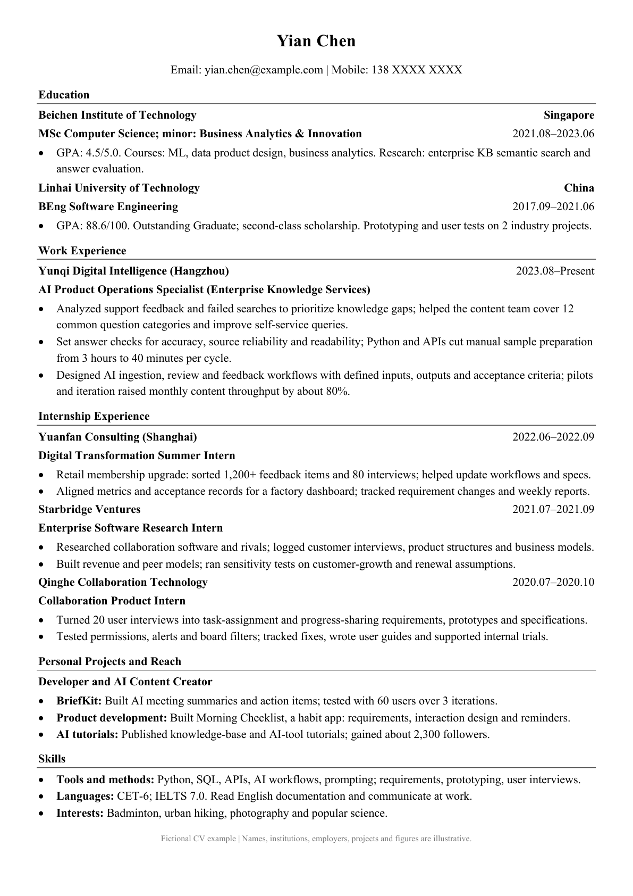
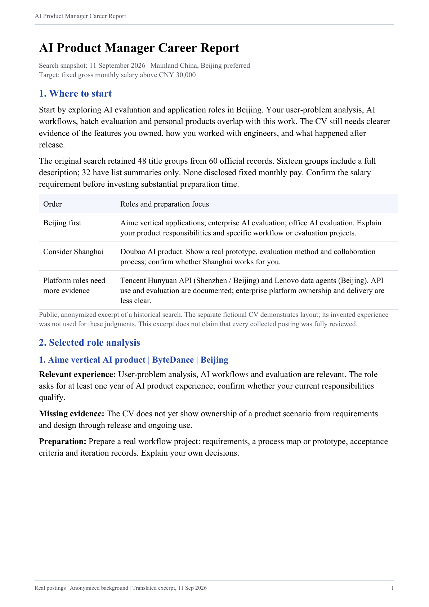
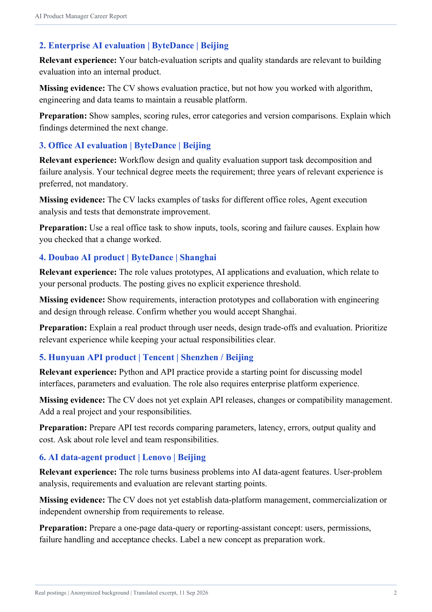

# job-hunt: busca empleo, crea tu CV y practica entrevistas

<p align="center">
  <a href="README.md">简体中文</a> ·
  <a href="README_EN.md">English</a> ·
  <a href="README_JA.md">日本語</a> ·
  <a href="README_KO.md">한국어</a> ·
  <a href="README_ES.md"><strong>Español</strong></a>
</p>

<p align="center">
  <a href="LICENSE"></a>
  
  <a href="https://github.com/addsumtech/job-hunt/releases"></a>
  <a href="https://skillhub.cn/skills/user_f486c577/best-job-hunt"></a>
  <a href="https://clawhub.ai/dong845/skills/job-hunt"></a>
</p>

<p align="center">
  <a href="CHANGELOG.md">Registro de cambios (chino)</a>
</p>

<p align="center">
  
</p>

job-hunt es una skill de búsqueda de empleo para Claude Code y Codex. Te ayuda a encontrar ofertas, decidir dónde postularte, crear un CV en chino o inglés y otros documentos de candidatura, y practicar entrevistas.

Comparte tus objetivos, experiencia o el enlace de una oferta. El agente organiza la información, comprueba los requisitos, edita los documentos y revisa la maquetación. Incluye orientación para recién graduados, cambios de carrera, periodos sin empleo, perfiles técnicos y de investigación, y candidaturas internacionales.

## Qué puedes hacer

| Función | Cuándo usarla | Qué hace el agente |
|---|---|---|
| **discover · Buscar ofertas** | Tienes un objetivo, pero necesitas encontrar vacantes adecuadas | Busca por mercado y preferencias, lee la descripción completa de las ofertas seleccionadas y organiza enlaces y consejos |
| **assess · Decidir si postularte** | Quieres valorar un puesto concreto | Compara requisitos y experiencia, e identifica condiciones excluyentes, fortalezas, carencias y esfuerzo de preparación |
| **apply · Crear el CV y la candidatura** | Necesitas un CV o documentos adaptados a una oferta | Crea un borrador a partir de tu experiencia o edita el CV existente, maqueta Word/PDF y realiza revisiones independientes |
| **interview · Practicar entrevistas** | Quieres ensayar respuestas y preguntas de seguimiento | Simula una entrevista con la oferta y el CV, registra las respuestas y revisa la comunicación y el respaldo factual |

Puedes usar las funciones por separado o combinarlas según tus necesidades. Tú eliges el siguiente paso y presentas la candidatura con los documentos terminados.

## Primer uso

### 1. Instala y configura

Elige una opción en [Instalación](#instalación). Después, dile al agente en Claude Code o Codex:

```text
Configura job-hunt y empieza mi tarea con mi navegador habitual.
```

El agente comprueba y prepara las dependencias, e indica qué permisos del navegador o inicios de sesión debes completar. No necesitas otra skill ni extensiones del navegador.

### 2. Comparte lo que ya tienes

Para buscar ofertas, indica el puesto, mercado y preferencias. Para valorar una candidatura, comparte la oferta y tu experiencia. Para crear un CV, facilita el documento actual o tu formación, trayectoria y proyectos. Una entrevista simulada necesita la oferta y el CV. El agente pregunta por la información que falta; no tienes que rellenar antes una plantilla fija.

### 3. Pide la tarea que necesitas

Cada ejemplo es un punto de partida independiente:

```text
Usa job-hunt para buscar puestos de product manager de IA en Shanghái.
Usa job-hunt. Aquí tienes una oferta y mi CV. ¿Merece la pena postularme?
Usa job-hunt para convertir esta experiencia en CV en chino e inglés, en Word y PDF.
Usa job-hunt para hacer una entrevista simulada con esta oferta y mi CV.
```

## Qué recibes

| Entregable | Contenido |
|---|---|
| **Informe de orientación profesional (PDF)** | Enlaces a ofertas, análisis de adecuación, fortalezas y carencias, prioridades de candidatura o siguientes pasos según la tarea |
| **CV adaptado (Word/PDF)** | Un Word editable y un PDF maquetado, creados a partir de tu experiencia o adaptados a una oferta |
| **Documentos adicionales (a petición)** | Carta de presentación o motivación, formulario de la empresa o declaración organizada por criterios |
| **Preparación y devolución de entrevista (a petición)** | Guía de preparación, transcripción y evaluaciones independientes de la calidad de las respuestas y su respaldo factual |

Cada consulta incluye un informe; los demás documentos dependen de la tarea elegida. El formato se adapta al mercado y a la empresa: por ejemplo, el rirekisho y el documento de trayectoria profesional en Japón, o el supporting statement para el NHS y la función pública del Reino Unido.

La entrega se guarda en una sola carpeta `~/Downloads/<workspace-name>/`, organizada en `简历/` (CV) y `报告/` (informe). Las siguientes etapas usan la misma ubicación para facilitar el acceso a los documentos actuales.

## Cómo se comprueba y mejora el trabajo

### Ofertas completas y experiencia real

Un informe completo exige leer la descripción íntegra de cada oferta seleccionada. Los resúmenes sirven para la selección inicial. Si no se puede acceder a una descripción, el informe explica el motivo y la marca como pendiente; no cuenta como revisada.

Las modificaciones y los consejos se basan en la experiencia que aportes. El agente conserva el perfil original, edita una copia y enumera las evidencias que faltan. No inventa habilidades ni cifras de rendimiento y no predice las probabilidades de contratación.

### Tres revisiones independientes de IA del CV

| Perspectiva | Qué comprueba |
|---|---|
| **Sistema de seguimiento de candidaturas (ATS)** | Si el CV se puede procesar y sus palabras clave corresponden a los requisitos del puesto |
| **Selección de personal** | Claridad y requisitos básicos |
| **Responsable del equipo** | Si los proyectos, las responsabilidades y la experiencia respaldan los requisitos del puesto |

Un CV convencional se corrige y revisa hasta un máximo de tres rondas. Las carencias que requieren más experiencia real o documentación quedan señaladas. Los formularios y las declaraciones por criterios se comprueban según sus requisitos específicos.

### Maquetación y devolución de la entrevista

Antes de entregar, se revisa cada página de Word/PDF frente a la plantilla, las fuentes, la alineación, los espacios y la paginación. Tras un cambio se repite la revisión; los problemas de formato pendientes impiden dar el trabajo por terminado.

Después de la entrevista simulada, la calidad de las respuestas y su respaldo factual se evalúan de forma independiente, indicando qué detalles añadir y qué frases del CV revisar.

## Ejemplos de CV e informe

### CV en inglés

Imagen obtenida de un CV ficticio en PDF. Los nombres, centros, empresas, proyectos y cifras son ilustrativos. La versión china aparece en el [README en chino](README.md).

<p align="center">
  <a href="docs/assets/examples/cv-en.png"></a>
</p>

### Extracto del informe de búsqueda (en inglés)

Extracto anonimizado y traducido al inglés de una búsqueda real del 11 de septiembre de 2026, con valoraciones de puestos y preparación. Esta muestra histórica conserva algunas ofertas que solo tenían un resumen; los informes completos actuales exigen leer cada descripción íntegra. El CV ficticio no se utilizó para estas valoraciones. Haz clic para ampliar.

<p align="center">
  <a href="docs/assets/examples/report-en-01.png"></a>
  <a href="docs/assets/examples/report-en-02.png"></a>
</p>

## Instalación

Necesitas un entorno de agente capaz de ejecutar comandos locales y leer y escribir archivos, además de **Python 3.10+**. Para instalar con `npx` también necesitas Node.js/npm. Elige una de estas cuatro opciones.

### Opción 1: instalar con `npx skills`

```bash
npx skills add addsumtech/job-hunt
```

Selecciona el agente y el ámbito de instalación cuando se solicite. Usa `-g` para instalar a nivel de usuario, `-a claude-code` o `-a codex` para elegir el agente y `-y` para omitir las confirmaciones. La raíz del repositorio es la skill; los scripts y los archivos de referencia deben instalarse junto con ella.

### Opción 2: instalar como plugin de Claude Code

Ejecuta dentro de Claude Code:

```text
/plugin marketplace add addsumtech/job-hunt
/plugin install job-hunt@job-hunt
/reload-plugins
```

Se invoca con `/job-hunt:job-hunt`. Para actualizar el marketplace, ejecuta `/plugin marketplace update job-hunt`. Si mantienes tanto una copia manual como el plugin, la misma skill puede aparecer dos veces.

### Opción 3: clonar y crear un enlace simbólico

Útil para leer o modificar el código. Este ejemplo registra la skill en Claude Code:

```bash
git clone https://github.com/addsumtech/job-hunt.git
cd job-hunt
mkdir -p ~/.claude/skills
ln -s "$PWD" ~/.claude/skills/job-hunt
```

Para Codex, sustituye `~/.claude/skills` por `~/.codex/skills` en las dos últimas líneas. Si el destino ya existe, revisa primero la instalación existente.

### Opción 4: instalar desde SkillHub o ClawHub

Abre la ficha de job-hunt en [SkillHub](https://skillhub.cn/skills/user_f486c577/best-job-hunt) o [ClawHub](https://clawhub.ai/dong845/skills/job-hunt) y sigue el proceso de instalación de la plataforma.

## Mercados e idiomas

Las fuentes incluyen 51job, Indeed, LinkedIn y BOSS Zhipin, según el mercado y las condiciones de acceso. En China también se consideran las preferencias por grandes o pequeñas empresas privadas, estatales y extranjeras. Nowcoder aporta experiencias de entrevistas y contexto de selección. Consulta el [catálogo de fuentes](references/discovery-sources.md) y la [política de uso](references/source-policy.md).

Los títulos y las etiquetas de datos personales del CV están disponibles en inglés, neerlandés, alemán, francés, español, italiano, chino, japonés y coreano. Los informes de búsqueda y valoración tienen [plantillas](references/report-localization.md) en chino, inglés, japonés, coreano y español. La investigación de empresas y sectores puede usar sitios oficiales, noticias, cuentas públicas de WeChat y proyectos de GitHub como [fuentes complementarias](references/supplementary-sources.md).

El repositorio incluye 5 tablas de convenciones de mercado con 38 entradas para Estados Unidos, Reino Unido, Alemania, Países Bajos y China, cada una con fuente, ámbito y fecha de revisión. Las fotos, los datos personales y los formatos siguen el mercado y los requisitos de la empresa; la información desactualizada o ausente se señala para su comprobación.

Los CV convencionales para Estados Unidos, Canadá, Reino Unido, Irlanda, Australia y Nueva Zelanda omiten por defecto las fotos y los datos personales relacionados. Los demás mercados reconocidos usan los datos aportados según sus reglas. Si el mercado está sin confirmar, esos campos se omiten.

## Configuración y preguntas frecuentes

### ¿Tengo que instalar las herramientas de búsqueda y maquetación?

Tras instalar la skill, el agente prepara los paquetes de Python, Node.js y OpenCLI con sus parches CDP desde una única herramienta de configuración. El cliente de AnySearch y el lector del navegador están incluidos; AnySearch busca mediante una API HTTP sin clave API. Las herramientas para maquetar el CV se preparan cuando hacen falta. Los informes usan fuentes incluidas por defecto y respetan las elegidas expresamente, sin sustituirlas en silencio. Consulta la [configuración del entorno](references/agent-setup.md).

### ¿Por qué el navegador pide permiso?

El agente usa CDP, una conexión de depuración remota, para acceder a tu Chrome o Edge habitual y aprovechar la sesión abierta. La primera vez puede requerir activar la depuración en `chrome://inspect/#remote-debugging` y aceptar la conexión. El agente comprueba la compatibilidad y te guía. Reutiliza la conexión durante la tarea y consulta fuentes independientes en paralelo cuando es posible. Solo usa un navegador separado si lo pides expresamente. Consulta las [conexiones del navegador](references/daily-browser.md).

### ¿Qué pasa si hay que iniciar sesión, verificar el acceso o no se puede leer una oferta?

El agente pausa esa fuente y te indica cómo completar el inicio de sesión o la verificación. Responde «listo, continúa» para seguir. Si el acceso sigue sin estar disponible, puedes facilitar el texto de la oferta o dejarla pendiente.

Primero se verifica OpenCLI; el lector CDP incluido solo se usa tras confirmar una incompatibilidad. El adaptador de Indeed conecta actualmente con Estados Unidos y los demás mercados priorizan fuentes locales. Los parches conocidos de Indeed y 51job son para OpenCLI 1.8.7 y pueden comprobarse o revertirse. También se puede utilizar directamente el buscador del sitio. Consulta la [resolución de problemas de compatibilidad](references/opencli-compat.md).

### ¿Dónde se guardan los perfiles originales y los archivos de trabajo?

Esta skill usa `~/.claude/job-profiles/` como almacenamiento compartido predeterminado. No es una carpeta incluida en Claude Code o Codex: se crea cuando es necesario al guardar un perfil. Ambos agentes comparten la ubicación para reutilizar tus datos; puedes cambiarla con `JOBHUNT_PROFILES_ROOT`. Los perfiles se conservan por idioma y las candidaturas tienen espacios de trabajo separados de los informes y CV entregados. Markdown, las fuentes `.tex` cuando correspondan y los registros de comprobación facilitan posteriores ediciones y trazabilidad. Consulta la estructura en [REFERENCE.md](REFERENCE.md).

Los archivos se almacenan localmente; las llamadas al modelo y el acceso web dependen del agente y la configuración de sus servicios.

## Verificación y documentación

<details>
<summary>Ver comprobaciones para desarrolladores, evaluaciones y documentación técnica</summary>

Las comprobaciones automáticas cubren las referencias a evidencias, la conservación del perfil original, la lectura de los veredictos, los datos personales, la composición y los cambios de modo:

```bash
python3 -m pip install pytest
make check
make eval-lint
```

`make check` ejecuta las pruebas de Python, las comprobaciones del contenido migrado y las tablas de mercado. Las pruebas que usan herramientas externas necesitan tenerlas instaladas; las comprobaciones de la instalación local de la skill son opcionales.

[`evals/`](evals/README.md) contiene 20 escenarios de comportamiento. La segunda iteración (2026-09-05/06) ejecutó 15 escenarios con y sin la skill, una vez por grupo (n = 1). Diez comprobaciones pasaron de `FAIL` en la referencia a `PASS` con la skill. El [registro de evaluación](evals/iterations/iteration-2-with-skill.md) recoge los resultados, las comprobaciones pendientes y el escenario invalidado.

Los tres revisores de CV se probaron mediante `codex exec` el 2026-09-06. Consulta [portabilidad entre agentes](references/portability.md) para configurar otros entornos y conocer el alcance de las pruebas.

- [SKILL.md](SKILL.md): selección de modos y reglas principales.
- [REFERENCE.md](REFERENCE.md): arquitectura, espacios de trabajo, estructuras de datos y uso de scripts.
- [Perfil de ejemplo](assets/profile.example.yaml) y [ejemplo de fuentes de afirmaciones](assets/claims.example.yaml): formatos de datos estructurados.
- [Guía de evaluación](evals/README.md): métodos y limitaciones.

Estas referencias técnicas están redactadas principalmente en inglés. Distribuido bajo la [licencia MIT](LICENSE).

</details>
