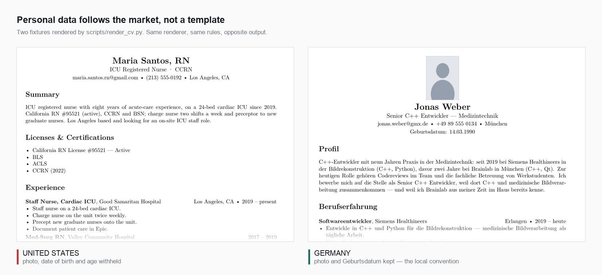

# job-hunt: 공고 탐색, 이력서 작성, 면접 연습

<p align="center">
  <a href="README.md">简体中文</a> ·
  <a href="README_EN.md">English</a> ·
  <a href="README_JA.md">日本語</a> ·
  <a href="README_KO.md"><strong>한국어</strong></a> ·
  <a href="README_ES.md">Español</a>
</p>

<p align="center">
  <a href="LICENSE"></a>
  
  <a href="https://github.com/addsumtech/job-hunt/releases"></a>
</p>

<p align="center">
  
</p>

job-hunt는 Claude Code와 Codex에서 쓰는 취업 지원 Skill입니다. 채용 공고를 찾고 지원할지 판단하는 일부터 이력서와 지원 동기서 작성, 모의 면접까지 도와줍니다.

목표, 이력서 또는 공고 링크를 주면 Agent가 채용 요건과 경력을 비교하고 문서 수정, 편집, 검토를 진행합니다. 기술·연구 직군, 직무 전환, 경력 공백, 신입 지원, 해외 취업에 맞는 안내도 제공합니다.

## 지금 필요한 단계부터 시작하세요

| 모드 | 사용하는 상황 | 주요 결과물 |
|---|---|---|
| **discover · 공고 탐색** | 원하는 분야의 공고를 찾고 싶을 때 | 공고 목록, 원문 링크, 초기 조언 |
| **assess · 지원 검토** | 관심 있는 공고에 시간을 투자할지 판단할 때 | 요건별 근거 비교, 필수 자격 조건, 부족한 점, 지원 조언 |
| **apply · 서류 준비** | 지원할 직무를 정하고 맞춤 서류가 필요할 때 | 맞춤 이력서, 선택적 지원 동기서, 검토 기록, 면접 준비 자료 |
| **interview · 모의 면접** | 공고와 이력서를 바탕으로 답변을 연습하고 돌아볼 때 | 모의 면접 한 회차, 대화 기록, 독립된 두 평가, 추가 확인 사항 |

각 모드는 따로 쓸 수 있습니다. 한 회차가 끝나면 Agent가 다음 단계를 제안하고 계속할지는 사용자가 결정합니다. 완성된 지원 서류는 사용자가 제출합니다.

설치 후에는 다음과 같이 요청할 수 있습니다.

```text
job-hunt를 사용해서 네덜란드의 MRI 영상 재구성 관련 채용 공고를 찾아 주세요.
job-hunt를 사용해서 이 공고 링크와 제 이력서를 보고 지원할 만한지 평가해 주세요.
job-hunt를 사용해서 이 직무에 맞게 이력서를 다듬고 지원 동기서를 작성해 주세요.
job-hunt를 사용해서 이 공고와 제 이력서를 바탕으로 기술 모의 면접을 진행해 주세요.
```

Agent는 먼저 이번 작업과 지원 지역을 확인한 뒤 필요한 자료와 선호 조건을 묻습니다.

## 지원 서류를 준비하는 과정

이력서를 수정할 때는 프로필, 사용자의 답변, 논문, 프로젝트에서 경력을 확인하고 내용의 순서와 표현을 다듬습니다. 근거가 부족한 내용은 추가 확인 항목으로 정리합니다. 수정에는 사본을 쓰고 원본 프로필은 보관합니다.

공고를 평가할 때는 요건을 경력과 하나씩 비교해 충족, 부분 충족, 근거 부족으로 구분합니다. 취업 허가와 면허 등 필수 자격을 먼저 확인하고 지원 조언과 추가로 필요한 자료를 정리합니다.

일반 이력서는 세 번의 독립된 AI 검토를 거칩니다. ATS 검토자는 키워드와 파일 인식을, 채용 담당자 검토자는 가독성과 기본 자격을, 현업 책임자 검토자는 경험과 담당 업무를 확인합니다. 수정과 재검토는 최대 세 회차 진행하며 추가 경험이나 자료가 필요한 항목은 따로 표시합니다.

전달 전에는 제공된 템플릿과 이후 요청에 따라 Word/PDF의 모든 페이지를 검토합니다. 글꼴과 크기, 여백, 제목 구분선, 날짜 정렬, 문단 간격, 내용 순서와 페이지 나눔을 확인합니다. 검토하지 않은 페이지나 해결되지 않은 서식 차이가 있으면 완료로 표시하지 않으며, 파일을 수정한 뒤에는 다시 검토합니다.

모의 면접 후에는 답변의 질과 사실 근거를 각각 독립적으로 평가합니다. 더 설명하면 좋을 구체적인 경험과 고쳐야 할 이력서 표현을 확인할 수 있습니다.

## 설치

로컬 명령을 실행하고 파일을 읽고 쓸 수 있는 에이전트 환경과 **Python 3.10+**가 필요합니다. `npx` 설치에는 Node.js/npm도 필요합니다. 아래 네 가지 중 하나를 선택하세요.

### 방법 1: `npx skills`로 설치

```bash
npx skills add addsumtech/job-hunt
```

안내에 따라 에이전트와 설치 범위를 선택합니다. 사용자 전체 범위로 설치하려면 `-g`, 에이전트를 지정하려면 `-a claude-code` 또는 `-a codex`, 확인 프롬프트를 건너뛰려면 `-y`를 사용합니다. 저장소 루트가 Skill 본체이므로 스크립트와 참고 파일도 함께 설치해야 합니다.

### 방법 2: Claude Code 플러그인으로 설치

Claude Code 안에서 실행합니다.

```text
/plugin marketplace add addsumtech/job-hunt
/plugin install job-hunt@job-hunt
/reload-plugins
```

`/job-hunt:job-hunt`로 호출합니다. 마켓플레이스 갱신에는 `/plugin marketplace update job-hunt`를 사용합니다. 수동 복사본과 플러그인을 함께 설치하면 같은 Skill이 두 번 표시될 수 있습니다.

### 방법 3: 저장소 복제 후 심볼릭 링크 생성

소스를 읽거나 수정하려는 경우에 적합합니다. 아래는 Claude Code에 등록하는 예시입니다.

```bash
git clone https://github.com/addsumtech/job-hunt.git
cd job-hunt
mkdir -p ~/.claude/skills
ln -s "$PWD" ~/.claude/skills/job-hunt
```

Codex에서는 마지막 두 줄의 `~/.claude/skills`를 `~/.codex/skills`로 바꿉니다. 대상 경로가 이미 존재하면 기존 설치를 먼저 확인하세요.

### 방법 4: SkillHub 또는 ClawHub에서 설치

[SkillHub](https://skillhub.cn/skills/user_f486c577/best-job-hunt) 또는 [ClawHub](https://clawhub.ai/dong845/skills/job-hunt)에서 job-hunt 등록 페이지를 열고 해당 플랫폼의 설치 안내를 따르세요.

### 처음 사용: 환경 설정은 Agent에게 맡기세요

설치 후 “job-hunt를 설정하고 평소 쓰는 브라우저로 작업을 시작해 줘.”라고 요청하세요.

이 skill만 설치하면 됩니다. AnySearch 클라이언트와 브라우저 읽기 스크립트가 포함되어 있으며, Agent가 통합 설치 도구로 Python 패키지, Node.js, CDP 패치가 적용된 OpenCLI를 준비합니다. 다른 skill이나 브라우저 확장 프로그램을 따로 설치할 필요가 없습니다. 상담 보고서 PDF는 기본적으로 포함된 글꼴을 사용하지만 명시적으로 지정한 글꼴을 우선하며 임의로 대체하지 않습니다. 이력서 조판 도구는 필요할 때 준비합니다. **브라우저는 CDP로 연결합니다.** 먼저 OpenCLI를 검증하고 호환성 문제가 확인되면 내장 CDP 리더를 사용합니다.


지원되는 환경에서는 평소 브라우저에 연결해 로그인 상태를 재사용합니다. 처음에는 `chrome://inspect/#remote-debugging`에서 원격 디버깅을 켜고 Chrome 연결 요청을 승인해야 할 수 있습니다. Agent가 지원 여부를 확인하고 필요한 조작을 안내합니다.

AnySearch는 HTTP API로 검색하며 API 키 없이 익명으로 쓸 수 있습니다. 브라우저 작업은 기본적으로 평소 사용하는 브라우저에 CDP로 연결해 진행하고, 별도 브라우저는 사용자가 명시적으로 요청한 경우에만 사용합니다. 독립적인 정보원은 가능한 범위에서 동시에 검색해 대기 시간을 줄입니다. 사이트 로그인, 인증, 브라우저 연결 승인은 사용자가 진행합니다.

자세한 방법은 [환경 설정](references/agent-setup.md)과 [브라우저 연결 및 병렬 검색](references/daily-browser.md)을 참고하세요.

### 채용 사이트를 읽을 수 없을 때

Indeed와 51job의 알려진 호환성 문제는 Agent가 확인하고 적합한 수정 사항을 적용합니다. 현재 패치는 OpenCLI 1.8.7용이며 다른 버전은 개별적으로 확인합니다.

채용 사이트의 검색창에서 직접 공고를 찾도록 요청할 수도 있습니다. 문제가 있으면 “채용 사이트 호환성 패치를 확인해 줘” 또는 “호환성 패치를 되돌려 줘”라고 말하세요. [확인 및 복원 방법](references/opencli-compat.md).

## 지역, 플랫폼, 언어

Agent는 지원 지역에 맞는 정보원을 골라 브라우저나 사용 가능한 OpenCLI 어댑터로 읽습니다. 정보원에는 51job, Indeed, LinkedIn, BOSS 直聘 등이 있습니다. Indeed 어댑터는 현재 미국 사이트에 연결하므로 다른 국가에서는 현지 정보원을 우선합니다. [정보원 목록](references/discovery-sources.md)에서 로그인 요건과 용도를, [이용 규칙](references/source-policy.md)에서 조회 범위를 확인할 수 있습니다.

중국 시장에서는 대형 민간기업, 중소 민간기업, 국유기업, 외국계 기업 등의 선호를 묻고 결과 순서에 반영합니다. 牛客와 一亩三分地는 면접 경험과 채용 절차를 알아볼 때 사용합니다.

로그인이나 인증이 필요한 사이트는 조회를 일시 중지하고 할 일을 안내합니다. 완료한 뒤 “완료했으니 계속해”라고 답하면 다시 확인합니다. 계속 접속할 수 없다면 나중에 시도하거나 공고 본문을 붙여 넣거나 이미 수집한 결과부터 살펴볼 수 있습니다.

이력서의 제목과 개인정보 항목명은 영어, 네덜란드어, 독일어, 프랑스어, 스페인어, 이탈리아어, 중국어, 일본어, 한국어를 지원합니다. 공고 탐색과 평가 보고서는 중국어, 영어, 일본어, 한국어, 스페인어의 [언어별 템플릿](references/report-localization.md)을 사용합니다. 일부 내부 자료는 영어이며 PDF 글꼴은 Agent가 환경 설정 때 확인합니다.

미국, 영국, 독일, 네덜란드, 중국의 시장 관행 표 5개에 총 38개 항목이 있습니다. 각 항목에는 출처, 적용 범위, 검토 날짜가 붙어 있습니다. 오래되거나 빠진 자료는 Agent가 알려 주며 실제 지원은 고용주의 요구에 맞춥니다.

<p align="center">
  
</p>

사진과 개인정보 표시는 지원 지역에 맞춥니다. 미국, 캐나다, 영국, 아일랜드, 호주, 뉴질랜드의 일반 이력서에서는 기본적으로 생략합니다. 그 밖의 확인된 지역은 해당 규칙에 따라 제공된 정보를 표시합니다. 지역이 확인되지 않으면 생략합니다.

## 받을 수 있는 결과물

| 자료 | 형식과 설명 |
|---|---|
| 맞춤 이력서 | Markdown, Word(`.docx`), PDF. PDF 조판 소스 `.tex`도 보존 |
| 커버레터·지원 동기서 | 필요할 때 생성하며 Markdown, Word, PDF 지원 |
| 일본식 이력서(履歴書) | 별도 양식 렌더러로 Markdown 미리 보기와 편집 가능한 `.docx` 생성. 양식 PDF는 Word 또는 LibreOffice에서 내보내기 |
| 항목별 지원 설명서 | NHS와 영국 공무원 등의 지원에 맞춰 요건별 근거를 정리하고 단어 수 제한 검사 |
| 평가와 면접 자료 | 공고 후보 목록, 적합성 평가, 면접 준비 자료, 모의 면접 기록과 피드백 |

항목별 평가 방식의 지원에서는 고용주 기준에 따라 supporting statement를 검토합니다. 일반 이력서도 필요하면 별도로 세 검토자의 심사를 진행합니다. 일본식 이력서는 양식의 완전성을 확인하며, 함께 제출하는 경력기술서 등은 일반 이력서 절차에 따라 검토합니다.

상담마다 취업 분석, 참고 자료, 확인할 사항을 담은 PDF 보고서를 만듭니다. 이력서 등과 함께 `~/Downloads/<workspace-name>/`에 저장하고 이후 단계에서도 같은 폴더를 사용합니다. 지원 동기서와 모의 면접은 필요할 때 요청할 수 있습니다.

결과물은 `简历/`(이력서)와 `报告/`(보고서)로 나누고 `简历.docx`, `简历.pdf`, `求职建议报告.pdf` 등의 이름으로 저장합니다.

기업이나 업계를 조사할 때는 공식 사이트, 뉴스, WeChat 공식 계정, 관련 GitHub 프로젝트 등의 [추가 정보원](references/supplementary-sources.md)도 활용할 수 있습니다.

## 파일 저장 위치

원본 프로필, 지원별 작업 공간, 검사 기록은 기본적으로 `~/.claude/job-profiles/`에 저장하며 Codex에서도 같은 위치를 사용합니다. 다른 루트 디렉터리는 `JOBHUNT_PROFILES_ROOT`로 지정할 수 있습니다.

한 사람의 원본 프로필을 `profile.zh.yaml`, `profile.en.yaml`처럼 언어별로 보관할 수 있고 기존 `profile.yaml`도 지원합니다. 지원 건별로 작업 공간을 분리하며 출처 기록과 `journal.jsonl`에 검사 이력을 남깁니다. 전체 구조는 [REFERENCE.md](REFERENCE.md)(영어)를 참고하세요.

파일은 로컬에 저장됩니다. 모델 호출과 웹 접근은 사용하는 에이전트 및 서비스 설정에 따라 이루어집니다.

## 검증과 참고 자료

자동 검사는 근거 참조, 원본 프로필 보호, 검토 결과 파싱, 개인정보 처리, 조판, 모드 간 전환 등을 다룹니다.

```bash
python3 -m pip install pytest
make check
make eval-lint
```

`make check`는 Python 테스트, 마이그레이션 내용 보존 검사, 시장 관행 표 검사를 실행합니다. 외부 도구를 사용하는 테스트는 해당 환경이 필요하며 로컬 Skill 설치 검사는 선택해서 실행할 수 있습니다.

[`evals/`](evals/README.md)에는 행동 평가 시나리오 20개가 있습니다. 2차 평가(2026-09-05/06)에서는 15개 시나리오를 Skill 사용·미사용으로 각각 한 번 실행했습니다(n = 1). 행동 검사 10개가 기준 실행의 `FAIL`에서 Skill 사용 시 `PASS`로 바뀌었습니다. 결과, 미실행 항목, 무효 시나리오는 [평가 기록](evals/iterations/iteration-2-with-skill.md)에 정리되어 있습니다.

세 이력서 검토자는 2026-09-06에 `codex exec`로 검증했습니다. 다른 Agent의 설정 방법과 테스트 범위는 [다른 Agent에서 사용하기](references/portability.md)를 참고하세요.

- [SKILL.md](SKILL.md): 모드 선택과 핵심 규칙.
- [REFERENCE.md](REFERENCE.md): 구조, 작업 공간, 데이터 형식, 스크립트 사용법.
- [프로필 예시](assets/profile.example.yaml)와 [서술 출처 예시](assets/claims.example.yaml): 구조화된 데이터 형식.
- [행동 평가 안내](evals/README.md): 평가 방법과 한계.

현재 기술 자료는 주로 영어로 작성되어 있습니다. [MIT License](LICENSE)로 배포합니다.
